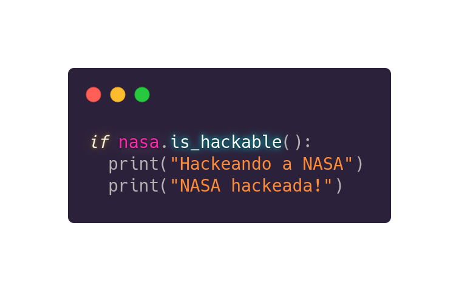

# Data science com Python
*Com alguns memes, jogos e sei lá mais o que*

 
A área de análise estatísticas e ciência teve, por muito tempo, 
o R como _linguagem oficial_ de programação. 
Certo, sabemos que esse tal de R é tri bom e tals, 
que é bem produtivo, mas esse negócio nitidamente é de nicho. 
E como pode então, crescer uma área (DataScience) se comunicando 
apenas no seu mundinho e não nos campos mais amplos? - to 
falando da área de desenvolvimento de software aqui - 
O que quero dizer, é que nenhum projeto relacionado a dados 
consegue se virar sozinho. Não é a _top lane_ do Liga das Lendas,
 por exemplo 
 ([_pra quem joga de blitz, obrigado_](https://www.youtube.com/watch?v=UwHWTlzIzII)). 
 Então, a galera (web moderna) meio que obriga que esses dados e códigos 
 sejam acessíveis de qualquer lugar ou por qualquer pessoa (obriga que sejam mais fáceis). 
 Beleza mas **como que faz isso?**

**Joãozinho prata coração de diamante diz:** Simples, é só fazer em PYTHON!

Ok Joãozinho, mas o porquê de Python?

**Joãozinho prata coração de diamante diz:** Pq eu gosto 

#### Calma lá jão, a gente explica melhor:

Como é necessário ter um maior e mais facilitado acesso aos 
códigos e dados, uma linguagem de propósito geral,
 como C (mais complexo), Java 
 ([eu acho que isso ném é uma linguagem](https://www.youtube.com/watch?v=VfeXuzJRalM)), ou então o PYTHON :heart_eyes:, 
 se elencam como linguagens alternativas ao R.

Sabemos que C é muito poderoso, mas talvez por ser um pouco mais baixo nível e de codificação "mais complexa" que o Python, fez com 
que Python se sobressaísse como uma ótima alternativa ao R para 
implementações de soluções baseadas em dados. Isso ocorre principalmente por sua simplicidade - *código em inglês estruturado* - e poder - 
*aproveita-se de bibliotecas escritas em C/C++*, 
mas vamos por partes como diria o Jack. Olhe um exemplo:

  

  

Viu o exemplo? Com apenas três linhas de código a NASA foi hackeada. 

----- 

Brincadeiras a parte, é extremamente simples de ler e entender um código Python 
(principalmente por ele não utilizar brackets e por obrigar a identação). Python também é 
_cross platform_ assim como esses jogos como Fortnite e Rocket League, o que quer 
dizer que, tu pode escrever um código nesse teu Linux (porque 
tu é *rasker*), nesse teu Windows aí (que pegou do Perigo), ou mesmo num macOS - 
_Se tu se encaixa no último caso o André Mathias tem um olhar pra ti_ - e executar em
qualquer outra plataforma também.

  

 

E um dos **fatores mais importantes** que contribuiu para que o Python se torna-se uma ótima 
alternatina ao R, é que diferente do teu time na rankeada, 
Python tem uma grande comunidade que contribui pro avanço e 
melhoria da mesma, construindo vários pacotes e bibliotecas (muitas delas em C/C++ como mencionado) 
para resolverem uma grande gama de tarefas, incluindo... advinha?
 Isso mesmo mãe Dináh, **Data Science** e **Analytics**.

------

  

 

 - Esse guia não é recomendado pra iniciantes em Python. 
 Entretanto, se você já tem familiaridade com outras linguagens 
 de programação (e.g. C, C#, JS) você conseguirá aprender 
 Python tranquilamente. Já que os conceitos de programação são 
 (a maioria) os mesmos, só muda a sintaxe. Então ok, asas batendo, marcha de decolagem, turbinas e JÁ!!!

  

------
## PyData

Esse termo nem é oficial mas sim um título coloquial que se 
refere a coleção de pacotes e ferramentas comumente usados pela 
comunidade de Data science. Essas ferramentas se diferem um 
pouco, dependendo do material em que você está estudando, 
então vamos nos ater apenas aos mais utilizados 
(que aparecem na maioria dos papers/tutoriais). 

## Índice

- [NumPy](https://github.com/gustavocrod/Data-Science/tree/master/Tutorials/numpy.md)
